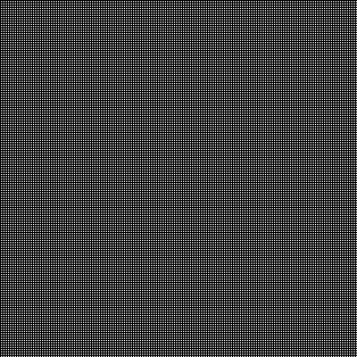
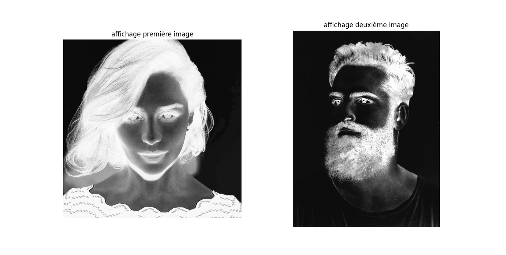
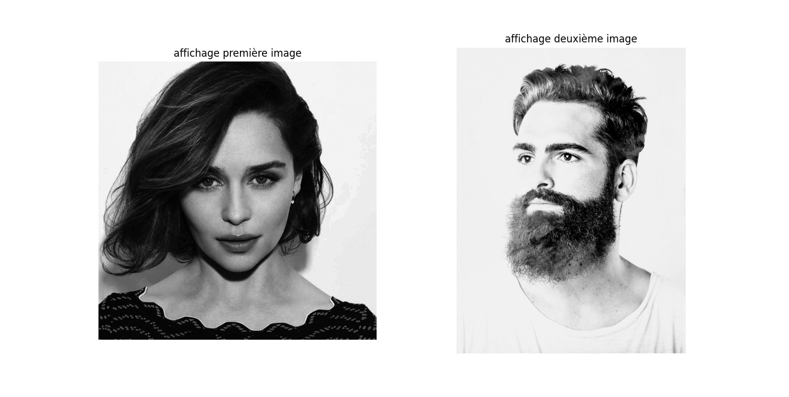
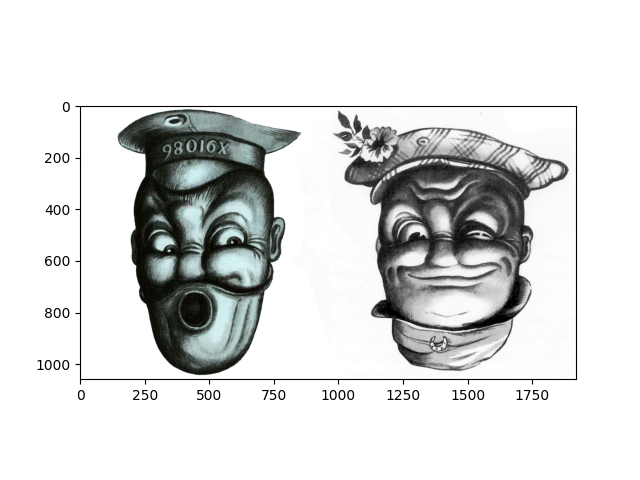

# image_processing_Assignment_21

1 ==> The first image processing code to build a chessboard (800*800)

2 ==> In the image below, dark and light colors have been shifted.

After processing

3 ==> Two upset men

After processing

