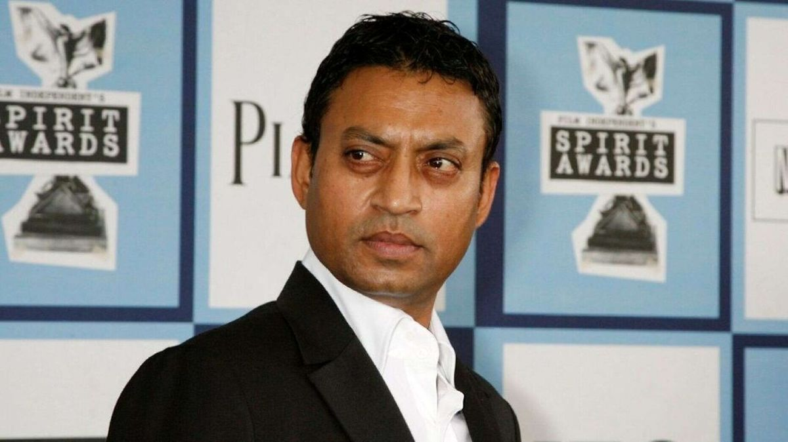
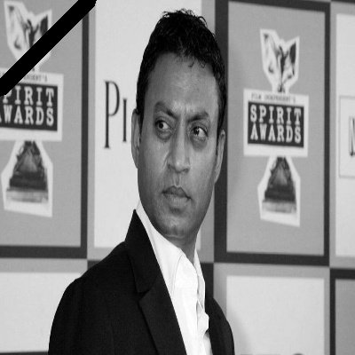

# image_processing_Assignment_21

<h2 align="center"><1 ==> The first image processing code to build a chessboard (800*800)></h2>

<h2 align="center"><2 ==> In the image below, dark and light colors have been shifted.></h2>

Before processing

After processing

  
<h2 align="center"><3 ==> Two upset men.></h2>

Before processing

  

After processing

  

<h2 align="center"><4 ==> algorithm for object detection and edge detection (beginner).></h2>

Before processing

    

After processing

  

<h2 align="center"><5 ==> Draw a black condolence ribbon to "irrfan khan".></h2>

Before processing

   

After processing

    

<h2 align="center"><6 ==> algorithm used to blend square colors.></h2>

